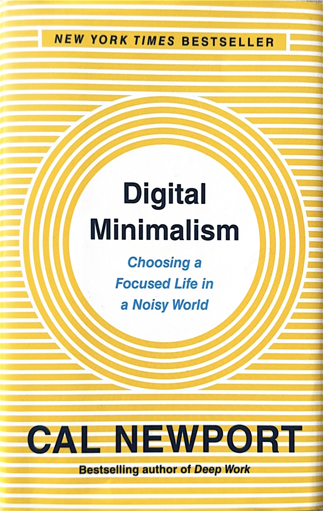
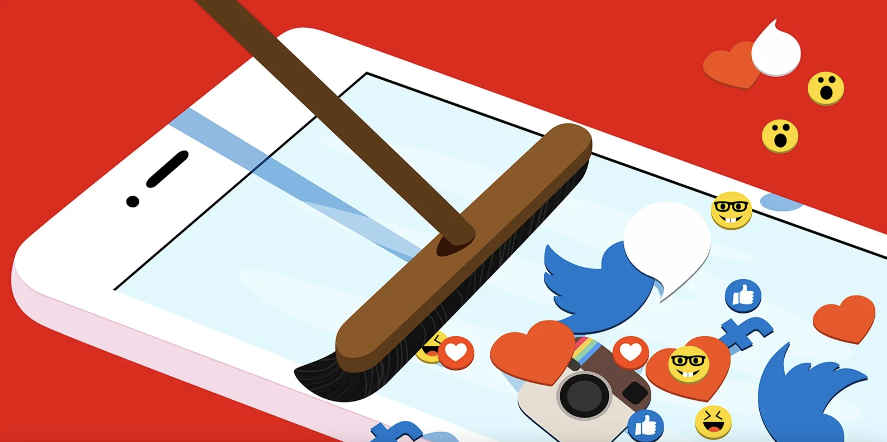
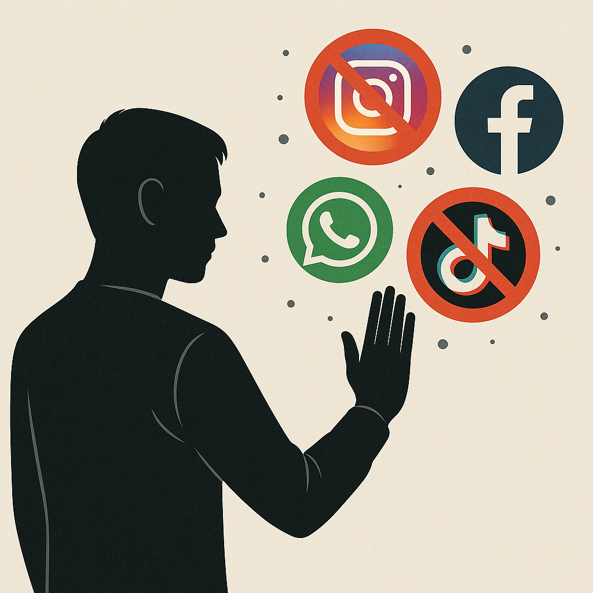

## Why I Picked It Up
I picked up *Digital Minimalism* because I often felt drained after hours of scrolling, yet I did not want to cut myself off from the benefits of technology. I wanted a system that would help me stay connected without losing focus and peace of mind. Newport’s book turned out to be exactly that kind of guide.  

The book is divided into two parts: **Foundations** (where the importance of digital minimalism in living a healthy life is explained) and **Practices** (where actionable strategies are shared).  

---

## The Digital Decluttering

Newport provides practical steps to make minimalism actionable. These include:  
- Cleaning up social media  
- Limiting Twitter and Reddit to purposeful use  
- Planning seasonal or weekly leisure that is structured and meaningful

---

## Low vs High Leisure

Newport draws a sharp line between **passive leisure** and **high-value leisure**.  
- **Passive leisure** → endless scrolling, binge content  
- **High-value leisure** → building, learning, creating something tangible  

High-value leisure brings real satisfaction and long-term rewards.

---

## Spend Time Alone

The book highlights the importance of solitude, not as isolation but as a healthy space to think, process, and recharge. In a world of constant input, this reminder feels powerful.

---

## Slow Media
Instead of chasing constant updates, Newport recommends slowing down news consumption. A weekly deep dive into reliable reporting gives a clearer and calmer picture than skimming through every headline or notification.

---

## The Last Chapter: Join The Attention Resistance

The final chapter makes a strong case for keeping your social media circle small and intentional. Newport suggests adding only people you know closely and skipping endless meme pages or celebrity accounts.  

You don’t need to chase them; that content will find you anyway. A focused feed removes distraction and makes your online time more valuable.

---

## Final Thoughts
What I loved most is how well these lessons fit into modern life. They make it easier to step out of the online bubble without feeling left out.  

*Digital Minimalism* is refreshing, practical, and a must-read for anyone seeking clarity and balance in a noisy world. Newport, a computer science professor, isn’t against digital media but advocates for **better use of it**.  
