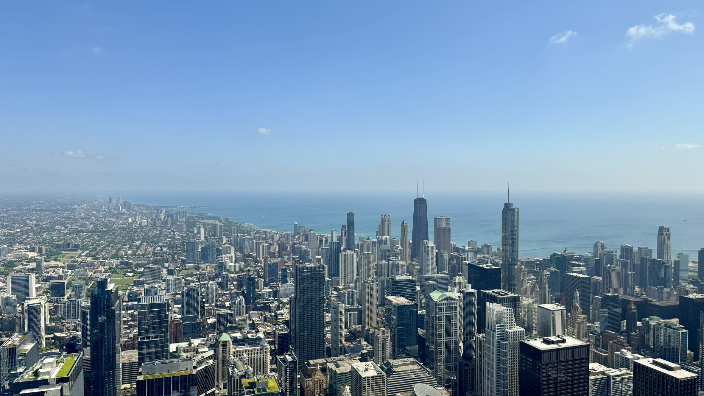
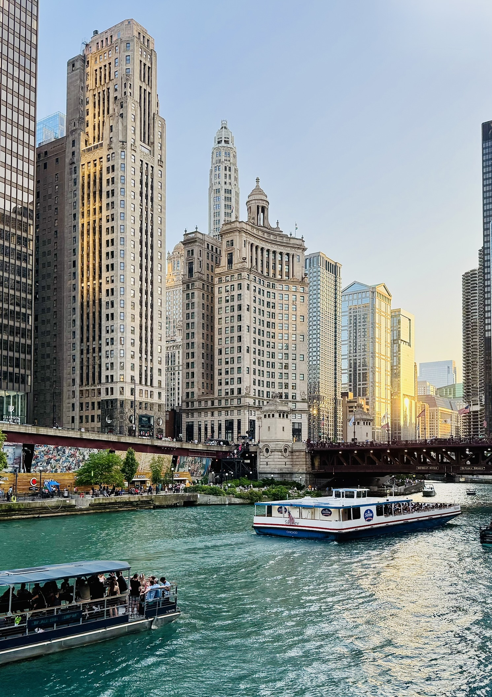
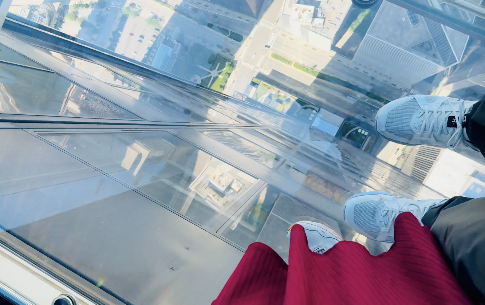
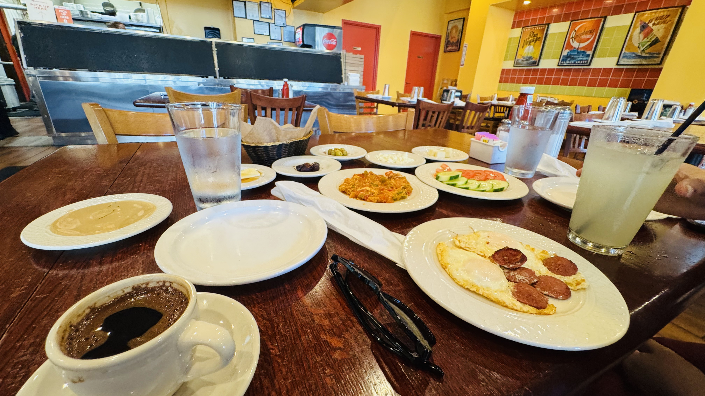
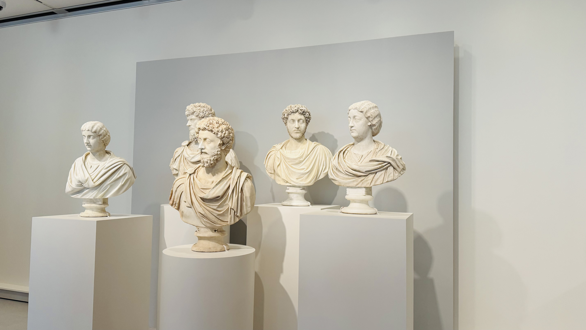
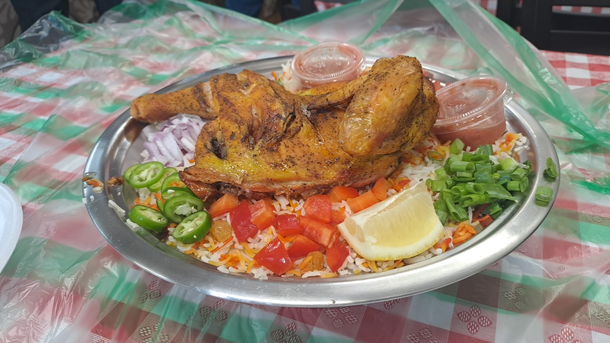
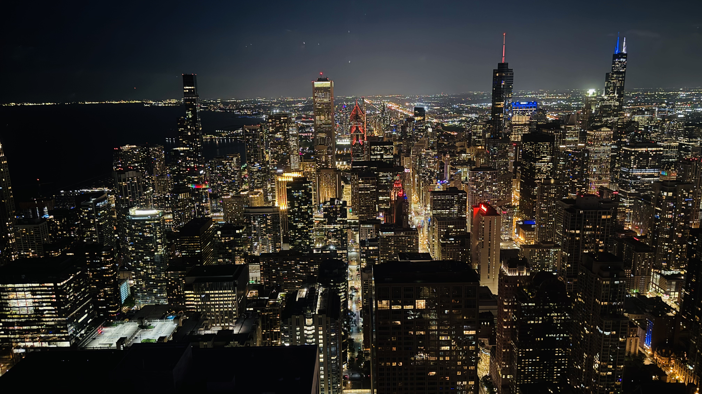

✨ A short but memorable getaway to Chicago ✨  

**Stay:** ACME Hotel, Downtown Chicago  
**Dates:** Saturday 21st June 2025 to Tuesday 24th June 2025

---

## Saturday: Arrival and First Impressions

We landed in Chicago around 1:45 PM after a morning flight from Dallas. From the airport, we used the CTA (Ventra card makes it super convenient) and reached ACME Hotel downtown by 4:00 PM.  

In the evening, we joined the **Architecture River Cruise** at golden hour. The city looked stunning as the lights came on and the skyline reflected in the river. It was the perfect start to the trip.

---

## Sunday: Towers, Art and Fountain Lights

We started the day with a **30-minute walk** through the city to reach the **Willis Tower** again, this time to see it in the morning light. From there, we stopped at a **Turkish restaurant** nearby for a hearty breakfast with fresh bread, eggs, tea, and an authentic touch of home-style flavors.

Next, we spent several hours at the **Art Institute of Chicago**. The museum was a treasure trove, but one highlight for me was the **sculpture of Marcus Aurelius**. As someone who appreciates Stoic philosophy, standing in front of that sculpture felt like connecting with centuries of wisdom and resilience.  

In the afternoon, we rested in the hotel after so much walking.

Later in the evening, we headed to **Buckingham Fountain** for the light show. Watching the fountain dance with the city skyline behind it was beautiful and relaxing.

---

## Monday: Beach, Food and Night Views

We began the day with a walk along **Ohio Street Beach** before continuing to **Navy Pier**. The June heat made the lakefront especially refreshing. The water was fresh, not salty as I first assumed it might be, since Lake Michigan is part of the Great Lakes system and filled by glacial meltwater, not the ocean.  

We booked an umbrella and beach seats, and honestly, I just wanted to stay in the water all day. The cool breeze and chill waves made it one of the highlights of the trip. Navy Pier itself added to the atmosphere with its open spaces and lakefront vibe.

After some rest at the hotel, dinner was at **Al-Diar Mandi**, where we enjoyed Yemeni cuisine, hearty and full of flavor. The night ended with a trip up to **360 Chicago**, soaking in sparkling city views from above.  

---

## Tuesday: Wrapping Up
On our last day, we visited the **Shedd Aquarium** late in the morning. It was more than just walking through exhibits, the highlight was the **dolphin show**. Watching dolphins leap, spin, and glide in perfect coordination was a wonderful way to wrap up the trip.  

Afterward, we checked out from the hotel, collected our luggage, and headed to the airport for our evening flight back to Dallas. 

---

## Extra Notes
- For transport, we mostly relied on **Uber** and the **CTA with Ventra**, which covered almost everything.  
- Meals were a mix of dining out and **Uber Eats** for convenience.  
- Staying inside downtown made everything accessible. If you are only in the downtown area, you do not need a vehicle. It is actually more convenient not to have one because parking is expensive and unnecessary.  
- Even simple things like water were pricey. The hotel charged per bottle, which made us wonder why most American hotels do not provide complimentary water in the rooms.

---

It was a short but eventful trip, blending culture, food, and cityscapes. Chicago left us with some great memories, and a reminder that water should not feel like a luxury in hotels.
